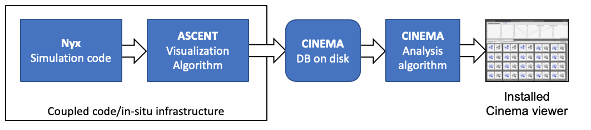

[](https://pantheonscience.github.io/standards/)

# End-to-end Nyx/ASCENT/Cinema Workflow

<p align="center">
    
</p>
<p align="center">Diagram of the workflow in this example.</p>

This is a [research](https://pantheonscience.github.io/standards/) release of an end-to-end pipeline for the [Nyx](https://amrex-astro.github.io/Nyx) code. Using the ECP ALPINE in situ infrastructure [ASCENT](https://github.com/Alpine-DAV/ascent), the pipeline accesses simulation data, defines and extracts an isosurface, then extracts a Cinema database of the results.

The output Cinema databases are further processed in a post-processing phase. It takes as input the Cinema databases produced by ASCENT as described above, computes several values on the images for each database, and at the end installs a Cinema viewer that includes a query on several variables.

The **task** for this workflow is to perform **a visual query**, and **quickly view and explore the results of the simulation, filtered by some computed values**. In this case, we use the `cinema` command line tool to compute the entropy and unique pixels of an image, and then view results constrained by ranges of the computed quantities. This can show us which images may be of interest, from the thousands of images that may be written into a Cinema database. 

This example can be easily adjusted to compute different quantities, and filter on different values, so it serves as a general example of a workflow that performs a visual query on a Cinema database.

<p align="center">

<br/>
Screen capture of the resulting Cinema database, viewed in Cinema:Explorer
</p>

## Workflow steps

The `main.workflow` file contains the [Popper](https://falsifiable.us) dependencies that are run during this workflow. The steps, executed in order, are:

- `install dependencies` This installs and builds the current master of Nyx in a scratch workspace.

- `execute` Runs Nyx on 8 nodes, using setup files in the `input` directory. This includes an `alpine_actions.json` file that creates a visualization and exports a Cinema database. 

- `check job completion` This step pauses the pipeline until the `execute` job finishes.

- `postprocess` Downloads the [`cinema_workflows`](https://github.com/cinemascience/cinema_workflows) repository, and runs one of the workflows that: 
    - analyzes the complexity of the images in the Cinema database, 
    - updates the database with additional images and metadata, 
    - installs a `Cinema:Explorer`,
    - zips up the entire result and reports where the result is found.


## Directory structure of workflow

```
    $PANTHEON_BASE_PATH             (set for your system)
        pantheon/                   (PANTHEONPATH)
            <pantheon workflow id>/ (PANTHEON_WORKFLOW_DIR)
                data/               (PANTHEON_DATA_DIR)
                results/
                <other directories>		
```

## How to run

1. Log onto Summit.
2. [Set up Pantheon in your environment.](https://github.com/pantheonscience/ECP-Artifacts/blob/master/usage.md)
3. In a shell:
```
    git clone --recursive git@github.com:cinemascienceworkflows/2020-04_Nyx-example.git
    cd 2020-04_Nyx-example
```
4. Check the settings in the `env.sh` file, to make sure they work with your account.
5. Then, type `popper run`. The workflow will build and install all necessary software, run the application, post-process the results, and then report where a final Cinema database can be found. 
6. Problems? email `pantheon@lanl.gov`


## Dependencies

- Pantheon. [Setup instructions here.](https://github.com/pantheonscience/ECP-Artifacts/blob/master/usage.md)
- Must run on Summit
- Bash
- Popper version v2.3.0+ [link](https://falsifiable.us)

## Constraints

This pipeline currently uses a pre-built ASCENT installation on Summit. If the pre-built installation is not found, the workflow attempts to build ASCENT from scratch. This scratch-build option is currently fragile, and later versions of this workflow will update to robust builds as they become available.

---
<!--- placeholder for LAUR
<small>LA-UR</small>
--->
