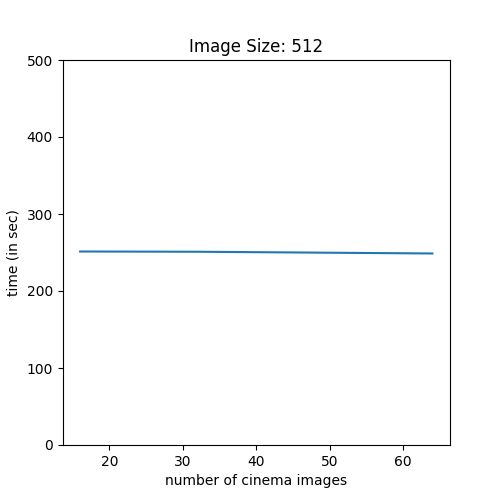
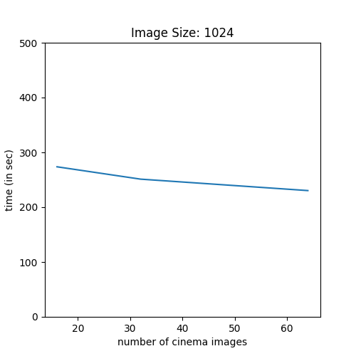

# ECP Milestone Parameter Study

**30 June, 2020**

This workflow has been adapted to be able to run a parameter study over the variables (number of processors, cinema phi values, cinema theta values, and image size). The framework allows expansion of this study to other variables.

Result files are automatically written out in named subdirectories. The `graph_results` script shown here shows an example of how to parse the names of the results directories. For the purposes of this study, we graphed the maximum operation time over all the timesteps for the processors. Thus, the results represent a maximum time for the operation. 

For simplicity, the number of processors is held constant for this example, which studies the total time to *render and write to disk* the Cinema database defined by the parameters. In this instance, the data was rendered as an isosurface.

## Results

The results show flat performance for different numbers of images, which is not expected. At this point, we have no explanation for the results, as we instead expect a basically linear increase in time as the number of images increases. The results do show, however, and expected increase in time for a larger image. We expect both overall time for the operation and the increase in time for the large image to be due largely to writing the image to disk. At present, there are no optimizations within the Ascent in-situ framework to allow different methods of writing out Cinema databases, so we are constrained to writing each image to disk.

| | |
|-|-|
|||

